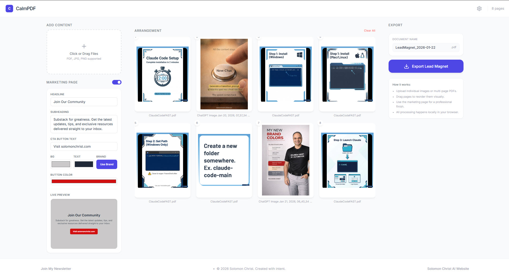
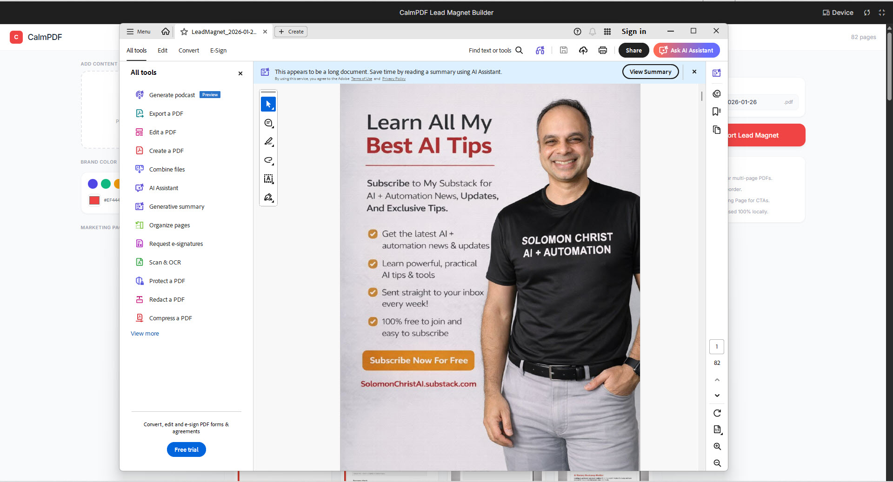

# CalmPDF Lead Magnet Builder, A Quiet PDF Builder for Lead Magnets

**CalmPDF Lead Magnet Builder** is an open-source, minimalist, local-first web app for creators, consultants, and marketers who want to build beautiful lead magnet PDFs without the chaos of traditional PDF tools.

How did I come up with the name? I wanted the experience to feel calm, quiet, and frictionless, like moving paper on a desk. So, CalmPDF.

**NOTE:** This was a Vibe Coded project using Google Gemini and ChatGPT for prompting by **Solomon Christ**, and updates are the responsibility of community contributors.

---

## 📄 Demo & Screenshots
  


## Vision
Creating a lead magnet should feel like moving paper on a desk, tactile, visual, and calm. CalmPDF removes the complexity of traditional PDF editors and replaces it with a simple drag-and-drop workflow for combining assets into one cohesive, professional document.

## Key Features
- **Local-First Privacy**: Everything runs in your browser. No cloud uploads, no servers.
- **Visual Reordering**: Drag and drop pages to instantly change the sequence of your PDF.
- **Multi-Source Support**: Upload individual images (JPG/PNG) and multi-page PDFs.
- **Smart Splitting**: PDFs are automatically split into individual pages for full layout control.
- **Page Tools**: Rotate, preview, and fine-tune each page like physical paper cards.
- **Marketing Page Generator**: Add an optional call-to-action page at the end, customizable with your brand colors, headline, and CTA.
- **High-Resolution Export**: Download a polished, distribution-ready PDF.

## How it Works
1. **Upload**: Drop images and PDFs into the upload zone.
2. **Arrange**: Drag paper-like page cards into your preferred order, rotate and preview as needed.
3. **Customize**: Toggle the Marketing Page, then add your brand colors, headline, and call-to-action.
4. **Export**: Name your file and download your final lead magnet PDF with one click.

## Offline First, Zero Uploads
CalmPDF processes everything on your machine.

There are **no uploads of documents**, ever.

You can even test it by turning off the internet and using the app, it still works.

## Tech Stack
- **React 18** (TypeScript)
- **Tailwind CSS** (Minimalist, calm UI)
- **Client-side PDF Processing** (Local execution only)
- **Drag-and-Drop Page UI**
- **High-Resolution PDF Export**

## Quick Start
NOTE: You need Node.js installed on your system.

1. Install dependencies:
   ```bash
   npm install
   ```
2. Run the dev server:
   ```bash
   npm run dev
   ```
3. Open the local URL shown in your terminal (usually `http://localhost:5173` or similar)

## Privacy Statement
CalmPDF is committed to user privacy.

- No servers for processing
- No trackers
- No analytics
- No cloud uploads
- Everything stays inside the client-side execution context of your browser

## License
MIT License. Copyright (c) 2026 Solomon Christ (www.solomonchrist.com).

---

**Created by Solomon Christ**  
[Solomon Christ Website](https://www.solomonchrist.com) | [AI Brief Substack](https://solomonchristai.substack.com/)
